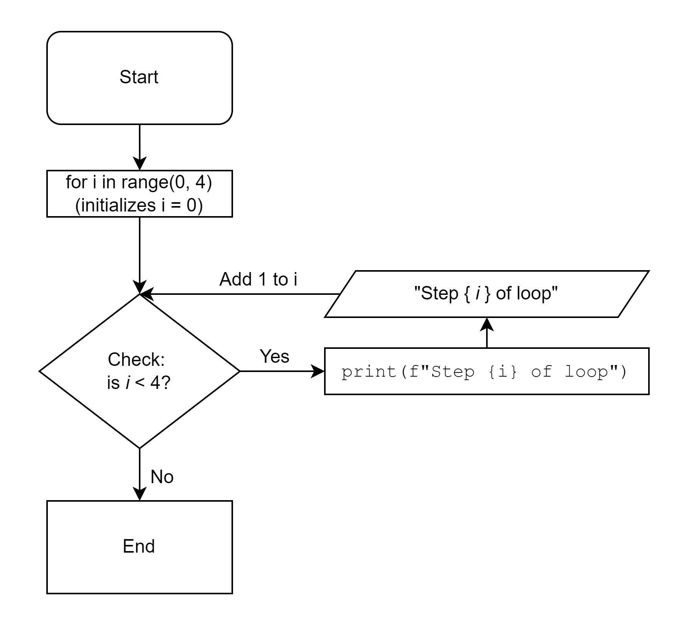
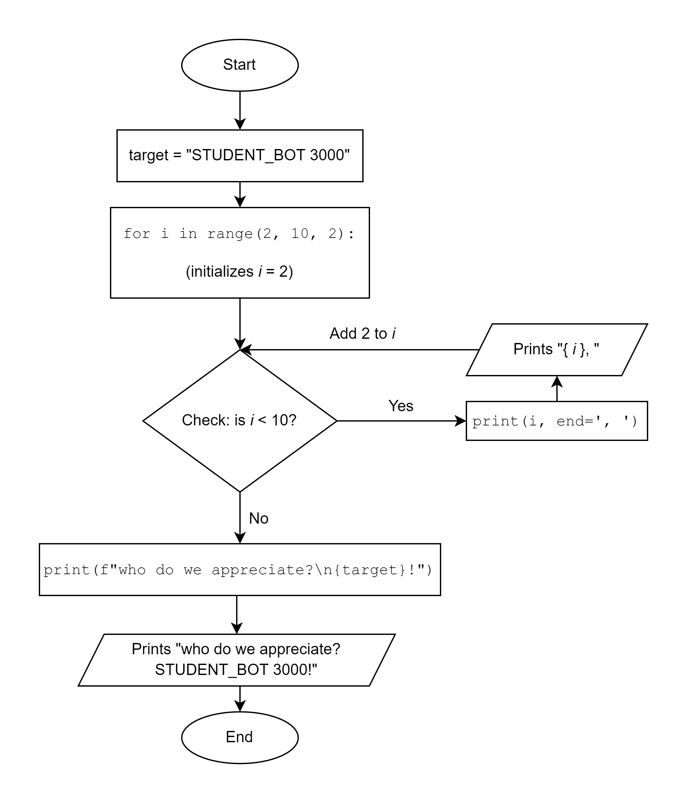
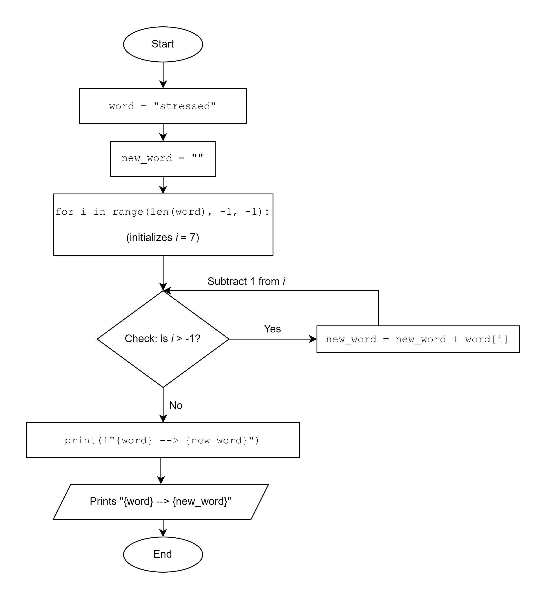

# Lesson: Introduction to For Loops

## Objectives:

Students will be able to:

* Follow the flow of a program that includes a for loop
* Construct a flowchart diagram for a program that includes a loop


## Methods Techniques Used
* CS Unplugged
* Trace Diagrams
* Live Coding

## Activities

### Demo: STUDENT_BOT 3000 (5 minutes)

* Introduce a volunteer student as STUDENT_BOT 3000
* STUDENT_BOT 3000 can only follow very simple movement instructions
* Please give STUDENT_BOT 3000 instructions to walk around this chair.
* Teacher will intervene if the directions are too complex.
* Teacher will acknowledge that some students may know where this activity is going - please don't give it away right at the start!

  * Target instructions:

      * Take 2 steps forward
      * Turn 90 degrees counterclockwise
      * Take 2 steps forward
      * Turn 90 degrees counterclockwise
      * Take 2 steps forward
      * Turn 90 degrees counterclockwise
      * Take 2 steps forward
      * Turn 90 degrees counterclockwise

* That took 8 instructions! Programmers HATE repeating their work.

* STUDENT_BOT 3000 understands repetition.

  * Do this 4 times:

      * Take 2 steps forward
      * Turn 90 degrees counterclockwise

* This pattern resembles a `for` loop in programming.

### Notes: `for` loops (15 minutes)

* Useful for repeating instructions
* Structure sample:

  ```python
  for i in range(0, 4): # starts the loop
    print(f"Step {i} of loop") # will be completed every step of the loop
  ```

* `range(0, 4)` starts at 0 and ends *before* 4

  * Values include 0, 1, 2, and 3
  * Note: this is consistent with indexing behavior for strings and lists

* What's happening behind the scenes?
  * `i` starts at 0
  * `i` increases by 1 after each step of the loop
  * When `i` is no longer in the range of values, the program exits the loop

* Flowchart diagram


Sequence of steps and printed output (write on board next to projected/drawn flowchart image):

* Start

| i | Condition | Actions |
|---|-----------|---------|
|i = 0| 0 < 4 ---> True | print(f"Step {i} of loop")<br />i += 1|
|i = 1| 1 < 4 ---> True | print(f"Step {i} of loop")<br />i += 1|
|i = 2| 2 < 4 ---> True | print(f"Step {i} of loop")<br />i += 1|
|i = 3| 3 < 4 ---> True | print(f"Step {i} of loop")<br />i += 1|
|i = 4| 4 < 4 ---> False | Exit loop| |

* End

* Printed output:

  * Step 0 of loop
  * Step 1 of loop
  * Step 2 of loop
  * Step 3 of loop

#### range()

* Exists only for iterating (going through a loop)
* Documentation (via `?range` in interactive shell)

  ```
  range(stop) -> range opject
  range(start, stop[, step]) -> range object

  Return an object that produces a sequence of integers from start (inclusive) to stop (exclusive) by step. range(i, j) produces i, i+1, i+2, ..., j-1.
  start defaults to 0, and stop is omitted! range(4) produces 0, 1, 2, 3.
  These are exactly the valid indices for a list of 4 elements.
  When step is given, it specifies the increment (or decrement).
  ```

* What does this mean? These are useful ways you can call the `range` function:

  * `range(stop)`
  * Example: `range(4)`

    *  Values from 0 (inclusive) to 4 (exclusive)
    *  0, 1, 2, 3

  * `range(start, stop)`
  * Example: `range(5, 10)`

    * Values from 5 (inclusive) to 10 (exclusive)
    * 5, 6, 7, 8, 9

  * `range(start, stop, step)`
  * Example: `range(5, 0, -1)`

    * Values from 5 (inclusive) to 0 (exclusive) *decreasing by 1*
    * 5, 4, 3, 2, 1

### Live Coding (5 minutes)
* I am going to make a program called `cheer.py` that prints the cheer below:
* "2, 4, 6, 8, who do we appreciate? <br /> STUDENT_BOT 3000!"
* Teacher-facing note:

```python
target = "STUDENT_BOT 3000"
#DELIBERATE-ERROR: choose 8 as "stop" value
for i in range(2, 8, 2):
#V2: range(2, 10, 2):
#STUDENT-Q: how can I adjust my print parameters to get 2, 4, 6, 8 on the same line instead of printing each number on its own line?
    print(i, end=', ')
#Mention: since we want this line to print once after the loop is done, we don't want this to be indented.
#STUDENT-Q: how do I write my print line to print the value of target on the next line?
print(f"who do we appreciate?\n{target}!")
```

* Resulting code:

```python
target = "STUDENT_BOT 3000"

for i in range(2, 10, 2):
    print(i, end=', ')
  
print(f"who do we appreciate?\n{target}!")
```

### Exercises:
Students will be provided with the end result of the above live code exercise.

1.  Draw a flowchart for the `cheer.py` code provided.
2.  Using the flowchart to assist you, trace `cheer.py` using the same table style we used in the notes.

#### Extra: If Time Allows
3.  Draw a flowchart for the following code, then trace it to determine the final printed output. Be sure to include a column in your table for the current value of `new_word`. *Hint: Make sense of the values in `range()` before you trace!

```python
word = "stressed"
new_word = ""

for i in range( len(word) - 1, -1, -1):
    new_word = new_word + word[i]

print(f"{word} --> {new_word}")
```

4.  What does the above code chunk do?


### Solutions:
#### Exercise 1:


#### Exercise 2:
| i | Condition | Actions |
|:---:|:-----------:|---------|
|i = 2| 2 < 10 ---> True | print(i, end=", ")<br />i += 2|
|i = 4| 4 < 10 ---> True | print(i, end=", ")<br />i += 2|
|i = 6| 6 < 10 ---> True | print(i, end=", ")<br />i += 2|
|i = 8| 8 < 10 ---> True | print(i, end=", ")<br />i += 2|
|i = 10| 10 < 10 ---> False | Exit loop| |

Variables:

* target = "STUDENT_BOT 3000"
<br /><br />


Printed output:

2, 4, 6, 8, who do we appreciate?<br />
STUDENT_BOT 3000!


#### Exercise 3:


| i | Condition | Actions | Value of `new_word` |
|:---:|:-----------:|---------|---------------------|
| i = 7 | 7 > -1 ---> True | new_word = new_word + word[7]<br />i -= 1| "d" |
| i = 6 | 6 > -1 ---> True | new_word = new_word + word[6]<br />i -= 1| "de" |
| i = 5 | 5 > -1 ---> True | new_word = new_word + word[5]<br />i -= 1| "des" |
| i = 4 | 4 > -1 ---> True | new_word = new_word + word[4]<br />i -= 1| "dess" |
| i = 3 | 3 > -1 ---> True | new_word = new_word + word[3]<br />i -= 1| "desse" |
| i = 2 | 2 > -1 ---> True | new_word = new_word + word[2]<br />i -= 1| "desser" |
| i = 1 | 1 > -1 ---> True | new_word = new_word + word[1]<br />i -= 1| "dessert" |
| i = 0 | 0 > -1 ---> True | new_word = new_word + word[0]<br />i -= 1| "desserts" |
| i = -1 | -1 > -1 ---> False | | "desserts" |

Variables:

* word = "stressed"
* new_word = "desserts"

<br /><br />

Printed output:

stressed --> desserts
